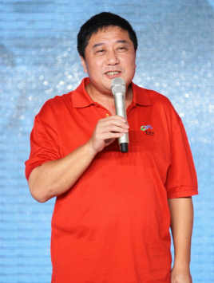
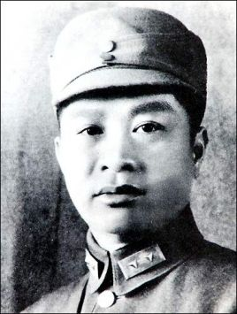

# 娱乐圈背景深厚的明星
盘点娱乐圈背景深厚的明星，主要指政军界背景。

## 中国大陆篇

### ## 1

[叶大鹰]([https://baike.baidu.com/item/%E5%8F%B6%E5%A4%A7%E9%B9%B0](https://baike.baidu.com/item/叶大鹰))，中国内地男导演、编剧。

爷爷是中国人民解放军的创始人之一、新四军军长[叶挺]([https://baike.baidu.com/item/%E5%8F%B6%E6%8C%BA/299649](https://baike.baidu.com/item/叶挺/299649))。

### ## 2

## 中国香港篇

## 中国台湾篇

## 海外活人篇